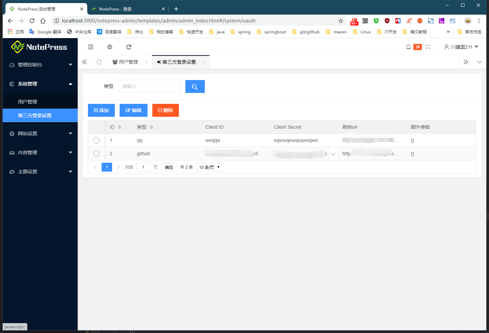

# LICENSE
> 基于 GPLv3 ，详情请查看：[百度百科：GPL协议](https://baike.baidu.com/item/GNU%E9%80%9A%E7%94%A8%E5%85%AC%E5%85%B1%E8%AE%B8%E5%8F%AF%E8%AF%81/393832?fromtitle=GPL%E5%8D%8F%E8%AE%AE&fromid=8274607&fr=aladdin)

- 此项目仅包含后端服务和博客前端，后台管理前端项目：请前往 [部署教程页面](https://wuwenbin.me/content/u/deployDoc) 获取

# 简介
> - 本项目基于之前我的 [noteblogv5](https://github.com/miyakowork/noteblogv5) 深度定制&升级&重构而来，经过代码重构一些处理逻辑和主题包升级等。 
> - 所有UI组件（文章卡片等）全部都是基于Layui构建的。 
> - NotePress是一款基于layui的响应式的个人/博客建站系统，简洁美观功能强大  
> - 点击链接加入群聊，获取更多信息【[NotePress ~ 交流反馈：697053454](https://jq.qq.com/?_wv=1027&k=5ZEGGl8) 】。 
> - 官网&文档&博客：<a href="http://wuwenbin.me" target="_blank"> 点我查看</a>

# 功能特色
+ 后台管理采用前后端分离方式，jwtToken模式鉴权，独立于前台，更安全。
+ 后端主要采用springboot、mybatis-plus。
+ 采用springboot、mybatis-plus、layui等多种流行框架。
+ 移动端适应良好，自带富文本编辑器和markdown编辑器两种类型，自由选择。
+ 网站风格设置多种（共5种风格设置），支持github、qq登录等第三方登录方式。
+ 网站包含丰富的个性化设置，包含开关类型、文本类型等设置（详情见下方预览图）。
+ 默认主题包含5种内容风格设置、2种笔记风格设置，且遵循响应式，多平台多分辨率都适配。
+ 支持主题定制功能，能够自由的更换网站的风格。
+ 更多详情请关注网站作者网站：<<[NotePress](https://wuwenbin.me)>> 。

# 更新日志 
+ [点我](https://wuwenbin.me/content/u/notepress_updatelog) 前往查看  

# 运行/部署步骤
> 请务必按照下面链接中文档的步骤来，这样能够帮你避免很多坑
+ [点我](https://wuwenbin.me/content/u/deployDoc) 前往查看  

# 更多信息
+ 加入QQ群获取最新项目/文件/资讯：[697053454](https://jq.qq.com/?_wv=1027&k=5ZEGGl8)

# 部分界面预览图

